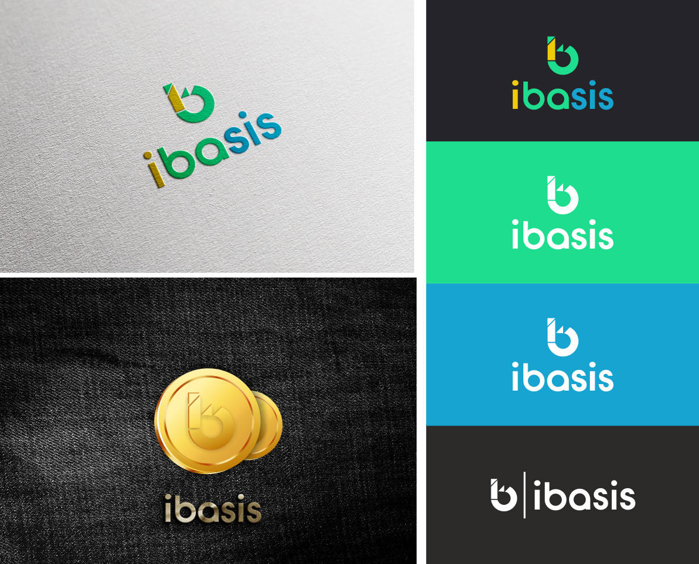

# iBasis Cash

Github：https://github.com/iBasis-developer
Twitter：https://twitter.com/iBasis_finance
Telegram：https://t.me/iBasis
Discord：https://discord.gg/9fn6DhCzgC
medium：https://ibasis-finance.medium.com/

iBasis Cash is a lightweight implementation of the [iBasis Protocol](iBasis.cash) 

## History of iBasis 

iBasis is an algorithmic stablecoin protocol where the money supply is dynamically adjusted to meet changes in money demand.  

- When demand is rising, the blockchain will create more iBasis Cash. The expanded supply is designed to bring the iBasis price iBAC down.
- When demand is falling, the blockchain will buy iBAC iBasis Cash. The contracted supply is designed to restore iBasis price.
- The iBasis protocol is designed to expand and contract supply similarly to the way central banks buy and sell fiscal debt to stabilize purchasing power. For this reason, we refer to iBasis Cash as having an algorithmic central bank.

iBasis was shut down in 2020, due to regulatory concerns its Bond and Share tokens have security characteristics. The project team opted for compliance, and shut down operations, returned money to investors and discontinued development of the project. 

## The iBasis Cash Protocol

iBasis Cash differs from the original iBasis Project in several meaningful ways: 

1. **Rationally simplified** - several core mechanisms of the iBasis protocol has been simplified, especially around bond issuance and seigniorage distribution. We've thought deeply about the tradeoffs for these changes, and believe they allow significant gains in UX and contract simplicity, while preserving the intended behavior of the original monetary policy design. 
2. **Censorship resistant** - we launch this project anonymously, protected by the guise of characters from the popular SciFi series Rick and Morty. We believe this will allow the project to avoid the censorship of regulators that scuttled the original iBasis Protocol, but will also allow iBasis Cash to avoid founder glorification & single points of failure that have plagued so many other projects. 
3. **Fairly distributed** - both iBasis Shares and iBasis Cash has zero premine and no investors - community members can earn the initial supply of both assets by helping to contribute to bootstrap liquidity & adoption of iBasis Cash. 

### A Three-token System

There exists three types of assets in the iBasis Cash system. 

- **iBasis Cash ($iBAC)**: a stablecoin, which the protocol aims to keep value-pegged to 1 US Dollar. 
- **iBasis Bonds ($iBAB)**: IOUs issued by the system to buy iBACk iBasis Cash when price($iBAC) < $1. Bonds are sold at a meaningful discount to price($iBAC), and redeemed at $1 when price($iBAC) normalizes to $1. 
- **iBasis Shares ($iBAS)**: receives surplus seigniorage (seigniorage left remaining after all the bonds have been redeemed).

### Stability Mechanism

- **Contraction**: When the price($iBAC) < ($1 - epsilon), users can trade in $iBAC for $iBAB at the iBABiBAC exchange rate of price($iBAC). This allows bonds to be always sold at a discount to cash during a contraction.
- **Expansion**: When the price($iBAC) > ($1 + epsilon), users can trade in 1 $iBAB for 1 $iBAC. This allows bonds to be redeemed always at a premium to the purchase price. 
- **Seigniorage Allocation**: If there are no more bonds to be redeemed, (i.e. bond Supply is negligibly small), more $iBAC is minted totalSupply($iBAC) * (price($iBAC) - 1), and placed in a pool for $BAS holders to claim pro-rata in a 24 hour period. 

## Motivation

This is not a DeFi project. We are simply leveraging the industry's excitement in the category to bring much deserved attention and engagement to the iBasis Protocol, and to use this opportunity to distribute ownership in the protocol fairly.

Our only motivation is to bring the iBasis Protocol into the world, and to serve its community in implementing iBasis' vision to become the first widely adopted decentralized dollar. To that end, we are committed to take no financial upside in iBasis Cash's success - we will raise no money and premine no tokens. Instead, when we feel that the protocol has found reasonable product market fit, we will ask the iBasis Shares DAO for donations to keep contributing to the protocol. 

## How to Contribute

Github：https://github.com/iBasis-developer
Twitter：https://twitter.com/iBasis_finance
Telegram：https://t.me/iBasis
Discord：https://discord.gg/9fn6DhCzgC
medium：https://ibasis-finance.medium.com/

_© Copyright 2020, iBasis.Cash_
